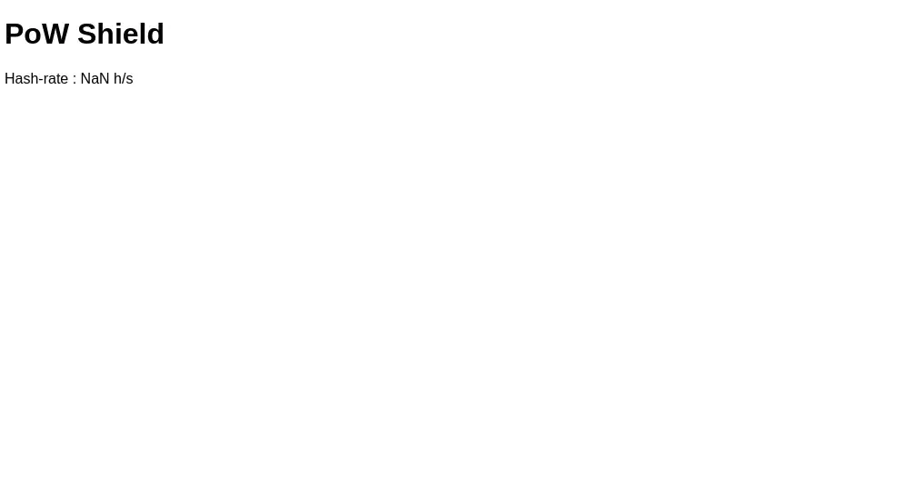

# PoW Shield

A nginx module to add a proof-of-work challenge before accessing a page.

In your nginx configuration file, add 'powshield "on";' to a server or a location.
The proof of work protection can also be disabled using 'powshield "off";'

